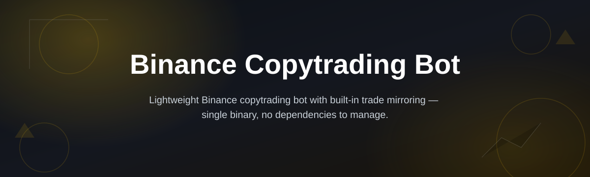
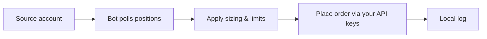

# binance-copytrading-bot

*For traders who want to mirror a chosen Binance account's positions automatically, without watching charts all day.*

## What this is

What this is **not**: a signal group, a prediction algorithm, or a magic profit switch. It does not analyze markets, guess price direction, or promise returns. If that's what you're after, this is the wrong repository.

What it **does**: `binance-copytrading-bot` connects to your Binance account through the official API and replicates the trades of a source account you select — same pairs, proportional sizing, same direction — with configurable delay and risk limits. It's built for people who already trust a specific trader's strategy and want their own account to follow it mechanically, on their own schedule, without manual copy-pasting of orders. The bot runs locally on Windows, holds your API keys on your machine, and never routes trades through a third-party server.

  

The button above opens the project landing page, where the current build is downloaded.

## Who it is for

- Traders who follow a specific strategy or trader and want it applied to their own account automatically.
- Small trading groups syncing a "lead" account across multiple members' wallets.
- Busy traders who can't watch positions in real time but still want to stay in sync with a chosen strategy.
- Developers testing copytrading logic against Binance's live or testnet API before building something custom.
- Anyone tired of manually re-entering the same trades a source account already opened.

## What you can do

- **Follow one or several source accounts** and mirror their open positions in near real time.
- **Scale position size** to your own balance instead of copying raw lot sizes.
- **Set a maximum exposure per pair or per account** so one bad trade can't drain your balance.
- **Filter which symbols get copied**, ignoring pairs you don't want to trade.
- **Delay execution** by a few seconds to avoid copying into thin liquidity spikes.
- **Run in dry-run mode** to see what would have been copied, without placing real orders.
- **Log every copied trade** with timestamp, source, and resulting order ID for later review.
- **Pause or resume copying per account** without restarting the whole bot.

## Getting started

1. Open the landing page and download the latest Windows build.
2. Extract the folder anywhere on your machine — no installer required.
3. Run the executable and enter your Binance API key/secret (read + trade permissions, no withdrawal).
4. Add the source account(s) you want to follow and set your sizing/risk limits.
5. Start in dry-run mode first, confirm the logs look right, then switch to live copying.

## Requirements

- Windows 10 or 11 (64-bit).
- No Python, Node, or any toolchain — it's a standalone executable.
- A Binance account with API keys created (trading enabled, withdrawal disabled).
- Stable internet connection; the bot needs to stay running to keep copying.

## How it works

1. You register a source account's public trade feed or connect via API to a shared strategy.
2. The bot polls for new or changed positions on the source side.
3. Each detected trade is resized according to your account's balance and limits.
4. An order is placed on your Binance account through your own API keys.
5. The result is logged locally, and the cycle repeats.

## FAQ

Is a Binance copytrading bot the same as Binance's built-in Copy Trading feature?

No. Binance's native feature only works with accounts enrolled in its official Copy Trading program. This bot works independently, connecting through the standard API, so you can follow accounts outside that program.

Do I need to give the bot my withdrawal permissions?

No, and you shouldn't. Create API keys with trading permission only. Withdrawal access is never required for copytrading.

Can I copy trades from more than one account at once?

Yes. You can add multiple source accounts and manage sizing/limits for each independently.

Will this guarantee profit if the source account is profitable?

No. Copying trades replicates entries and exits, not risk management skill, slippage conditions, or timing differences between accounts. Past results from a source account don't carry over automatically.

Does the bot work with Binance Futures as well as Spot?

Yes, both are supported. Set the market type per source account in the configuration.

## Troubleshooting

The bot shows "API key invalid" on startup

Check that the key was generated with trading permission enabled and that there's no leading/trailing space when pasting it in.

Trades are copied with a noticeable delay

Increase your polling interval setting, or check your internet latency. A slow connection widens the gap between source and copy execution.

Position sizes don't match what I expected

Review your sizing mode — proportional sizing scales to your balance, not the source account's absolute size. Switch to fixed sizing if you want a constant lot size instead.

The bot closes but doesn't reopen positions correctly

Confirm dry-run mode is off and that your API key hasn't hit Binance's rate limit — the log file will show a 429 error if that's the cause.

## License

Released under the [MIT License](LICENSE). This project is provided as-is, with no warranty of trading performance. Use your own risk limits — the maintainers are not responsible for trading losses.

  

